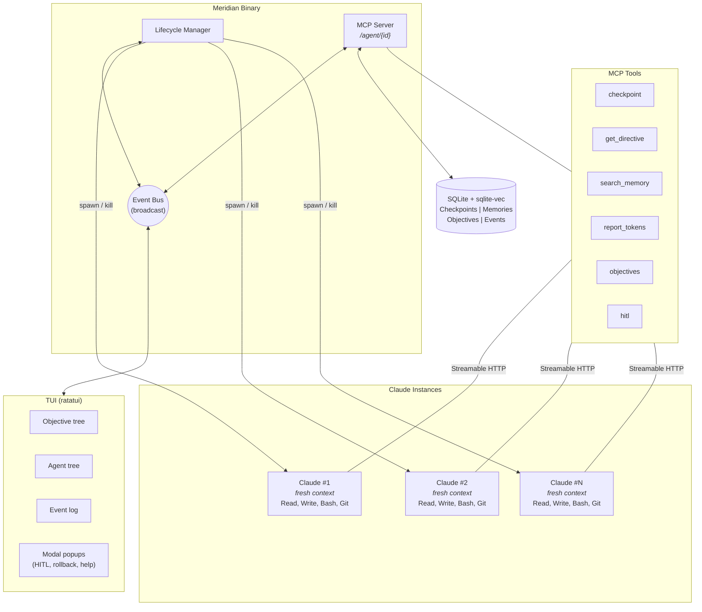

# Meridian

[](https://github.com/vaporif/meridian/actions/workflows/ci.yml)
[](https://github.com/vaporif/meridian/actions/workflows/audit.yml)

An agent runtime that lets LLMs work past their context window.

## The problem

LLM agents accumulate state in their context window. Around 100-150k tokens, they start degrading - lossy summaries, hallucinations, or they just stop being useful. If your task takes hours or days, a single context window won't cut it even with compaction.

## What Meridian does

Think of the LLM as a stateless process. When its "RAM" (context window) fills up, Meridian checkpoints to "disk" (SQLite + vector search), kills the process, and starts a fresh one that loads the checkpoint. The agent reasons. Meridian manages the lifecycle.



## How the lifecycle works

1. Agent runs, does work, accumulates context
2. Agent periodically self-reports token usage to Meridian
3. Agent polls `get_directive()` to check if Meridian wants it to do anything
4. When tokens hit the threshold (~80%), Meridian tells the agent to prepare for reset
5. Agent writes a layered checkpoint:
   - **L0** - objective state (~500 tokens, always restored)
   - **L1** - session summary (~2-5k tokens, always restored)
   - **L2** - detailed findings (retrieved on demand via semantic search)
6. Meridian kills the agent, spawns a fresh one with L0+L1 pre-loaded
7. New agent pulls L2 memories as needed through vector search

If the agent crashes or ignores instructions, Meridian force-kills at 85% and uses a heuristic crash summarizer instead.

## Design choices

The MCP server and lifecycle manager live in one binary. No IPC between separate processes, no split-brain where one thinks the agent is alive and the other doesn't.

Claude keeps its own tools (filesystem, bash, git). Meridian is a sidecar that only handles orchestration stuff - checkpoints, memory, objectives, directives. It doesn't need to see every file read.

All agents are owned flat by Meridian, not in parent-child trees. When a parent agent resets, it loses all memory of its children. Hierarchies just break. The Kubernetes model works better here - control plane owns everything, logical groupings are metadata.

SQLite with sqlite-vec is the default store. One `.db` file, ACID transactions for atomic checkpoints, no extra infrastructure. There's a `MemoryStore` trait so you can swap in Qdrant when you outgrow it.

Communication happens over streamable HTTP, not stdio. Stdio has a direction problem - the client spawns the server, but Meridian needs to be the long-lived process that spawns agents, not the other way around.

## Config

```toml
[meridian]
storage_backend = "sqlite"
sqlite_path = "./meridian.db"
embedding_model = "Xenova/bge-small-en-v1.5"

[lifecycle]
context_threshold_pct = 80
token_force_kill_pct = 85
hang_timeout_secs = 300

[supervision]
default_strategy = "one_for_one"
max_restarts = 5

[summarizer]
backend = "claude"
```

See `meridian.toml` for all options.

## Building

```
cargo build --release
```

Requires Rust edition 2024.

## Status

Early. Core types, store, MCP server skeleton, and an interactive TUI exist. The TUI is keyboard-driven with hotkeys, tree navigation, and modal popups for HITL responses and checkpoint rollbacks. Goals are loaded from `.md` files in a `goals/` directory. The actual agent spawning and checkpoint/reset loop aren't wired up yet.

## License

MIT
